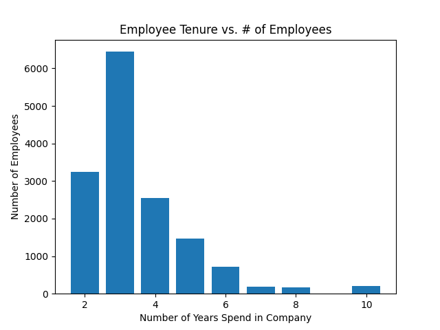

# Employee Turnover Analysis

## About
This project will analyze employee data and metrics in order to predict the companies employee retention. To further examine the trends we find, this analysis will conclude with the results we find after building a **random forest regression** model.

We will use this README.md as a report in which we discuss some of the findings we discover by analyzing the data as well how we reached these findings.

## Our Attributes

To begin our analysis, we need to understand the datasets attributes and what they mean. These are the 10 we can discuss:

* **satisfaction_level**: Measures an employees satisfaction within theirr company; ranges from 0-1.
* **last_evaluation**: An employees most recent evaluation from their employer; ranges from 0-1.
* **number_projects**: The number of projects an employee has been assigned.
* **average_monthly_hours**: The average amount of hours spent working by an employee during a month.
* **time_spent_company**: The number of years spent by an employee in the company.
* **work_accident**: Whether an employee has had a work accident or not.
* **promotion_last_5years**: Whether an employee has received a promotion within the last 5 years or not.
* **Departments**: Employee's working department/division.
* **Salary**: Salary level of the employee; ranges from low, medium and high.
* **left**: Whether the employee has left the company or not.

## A Dive Into Data Visualization

Our data serves little use in it's current form, so let's try a creating a few different graphs to help grasp the different relationships in our dataset.

Secondly, we can create a graph for the relationship between employee tenure and the how many employee's there are. See *Figure. 2* below.

