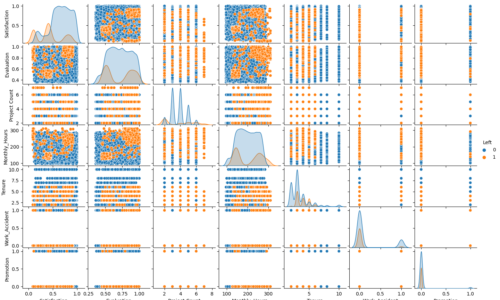

# Employee Turnover Analysis

## About
This project will analyze employee data and metrics in order to predict the companies employee retention. To further examine the trends we find, this analysis will conclude with the results we find after building a **random forest regression** model.

We will use this README.md as a report in which we discuss some of the findings we discover by analyzing the data as well how we reached these findings.

## Our Attributes

To begin our analysis, we need to understand the datasets attributes and what they mean. These are the 10 we can discuss:

* **Satisfaction**: Measures an employees satisfaction within theirr company; ranges from 0-1.
* **Evaluation**: An employees most recent evaluation from their employer; ranges from 0-1.
* **Project_Count**: The number of projects an employee has been assigned.
* **Monthly_Hours**: The average amount of hours spent working by an employee during a month.
* **Tenure**: The number of years spent by an employee in the company.
* **Work_Accident**: Whether an employee has had a work accident or not.
* **Promotion**: Whether an employee has received a promotion within the last 5 years or not.
* **Departments**: Employee's working department/division.
* **Salary**: Salary level of the employee; ranges from low, medium and high.
* **Left**: Whether the employee has left the company or not.

## A Dive Into Data Visualization

Our data serves little use in it's current form, so let's try a creating a few different graphs to help grasp the different relationships in our dataset.

Secondly, we can create a graph for the relationship between employee tenure and how many employee's there are. See *Figure. 2* below.

 
Figure. 2

Figure. 2 dispalys the seniority of employees. We see that the majority of employees are relatively new, with the bulk of the workforce haveing spent 3 years at the company.

***

Below we can see the average hours worked in comparison to the number of employees. See Figure. 3

 
Figure. 3

We can see an acceptional spike around the 150 hour mark per month. This gives us a better insight into the typical employee workload that our dataset would experience.

## Prepping Our Random Forest Model

Before we can create our random forest classifier we need to understand more about the data so we know the appropriate properties to assign. One of the ideal properties to decide on in a random forest algorithm is the number of trees needed to accurately classify the individual points.

By creating a histogram and scatterplot, we can gain valuable information that will help us make an informed decision. See 
Figure. 5

 
Figure. 5

When looking at our plotted graphs, the preferable situation would be a clear seperation between the the curves and data points. Looking above we can see that our two different classes are overlapping quite a bit. Since trees internally create lines when establishing the space between points, we can draw to a conclusion that more trees are needed in our forest to better classify our data points. 
